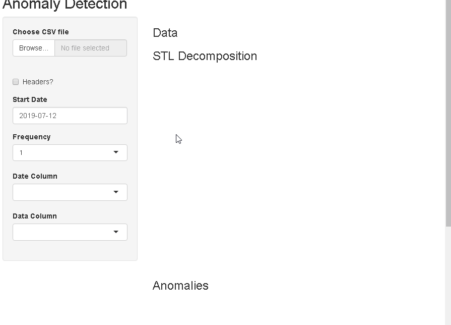

# AnomalyDetectionShiny

## Usage

1. Load `csv` file. Seperator must be `comma (,)`.
2. If your contains a header, please check `Headers?`.
3. Choose observation frequency by:

   - If observations annualy, choose 1,
   - If observations quarterly, choose 4,
   - If observations monthly, choose 12,
   - If observations weekly, choose 52.

4. Choose timestamp, datetime, ... column and data column.

## FAQ

> There is no graph on anomaly detection tab.

If there is no anomaly detected on data, app doesn't plot.
